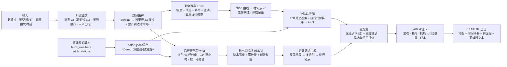

# 阳光充足 · 基于气象与能耗预测的物流调度 —— 方案与计划

> 赛事：百度地图开放平台 · 开发者创作大赛（智能物流 / 物流地图应用场景）
> 项目：`C:\Users\USER\Music\SunnynPoweredTrip`（`ohbj` 的同类分项目）
> 文档日期：2026-09-30 ｜ 状态：**已落地（本文档保留为决策依据；实现见 README）**
> 本文件 = 决策依据 + 开工蓝图。

---

## 实施状态（2026-09-30 回填）

| 计划项 | 状态 | 落地位置 |
|---|---|---|
| 离线数据生成（不联网、不耗配额） | ✅ | `tools/make_demo_data.py` → `data/*.json` |
| 预测与优化模型 | ✅ | `app/model.js`（纯函数，浏览器/Node 双用） |
| 三方策略统一择优（A/B/C） | ✅ | 就地补能 / 绕行避雨 / 服务区等待，同一把尺子比 |
| 自检（含几何回归测试） | ✅ 41 项全绿 | `tools/validate.mjs` |
| 单页 Demo | ✅ | `index.html` + `app/app.js`（地图/时间轴/剖面图/对比卡） |
| Banner 1200×675 | ✅ | `tools/make_banner.py`（数据驱动绘制，非截图） |
| 60 秒正片 | ✅ 60.0s / 6.4 MB | `tools/record_demo.py`（CDP 逐幁采集 + 烧字幕 + 自制配乐） |
| 未做 | ⏳ | 真实气象/真实 POI 接入；驾车 v2 实测绕行里程（当前为示意几何） |

> 实现过程中修正了本文的两个建模错误，详见 `docs/AI素材说明.md` §五：
> ① 低洼必须是**闸门（乘项）**而不是加项，否则“绕行”在数学上不起作用；
> ② 绕行的法向偏移在 (东, 北) 约定下要用 `(cosθ, −sinθ)`，写错会得到
> “部分沿航向”的位移，绕行**静默失效**。

---

## 0. 结论速览（TL;DR）

### 0.1 三个"必须改"的判定（已查官方文档，不是猜测）

| # | PRD 里的写法 | 实测结论 | 处置 |
|---|---|---|---|
| **A** | "调用百度**货车**路线规划 API（Truck API）" | **货车路线规划服务（Logistics Direction API）是企业付费产品**：文档原文「最低配置套餐包含 5 万配额、10 并发，**最低售价 10 万/年**」，且需在反馈平台申请试用权限（1–3 工作日） | ❌ **砍掉**。改用 **驾车路线规划 v2** + 自研「货车约束层」（限高/限重/限行规则表） |
| **B** | "传入 `avoid_polygons`（避让区）重规划" | **驾车/骑行/步行 v2 均无该参数**。v2 驾车只提供：多备选路线、**途经点 ≤18**、车牌规避限行、起点车头方向、未来 7 天出行规划 | ⚠️ **换路径**：自研「避让锚点 + 候选集惩罚打分」（见 §5.6） |
| **C** | "途经点自动优化" | 途经点智能规划 `intelligent_plan=1` 是**高级付费服务**，需联系工作人员开通 | ⚠️ 自己排途经点顺序（本站点数量少，可行） |

### 0.2 成立的部分（可放心依此开工）

| 能力 | 官方文档结论 | 对应模块 |
|---|---|---|
| **沿途逐小时气象** | 天气查询「**国内经纬度天气查询**」：按经纬度返回实时 + 未来 7 天 + **未来 24 小时逐小时预报** | 模块①气象预判 |
| 途经点插入 | 驾车 v2 支持 **≤18 个途经点** | 模块③补给插入 |
| 未来出行规划 | 驾车 v2 支持指定**未来 7 天任意出发时刻**，按预测路况与限行算路 | ✅ 与"预测驱动"高度契合，是本项目的加分点 |
| 车牌规避限行 | 驾车 v2 原生支持 | 货运场景可信度 |
| 补给站检索 | 地点检索（周边检索）可取名称/地址/`telephone` | 模块②补给匹配 |
| 前端 3D 展示 | JSAPI GL（Marker/Polyline/Polygon/InfoWindow + 自绘剖面 Canvas） | 全部 |

### 0.3 一条会决定成败的工程纪律

> **地点检索未认证仅 100 次/日**（ohbj 已实测）。本项目要"沿线采样天气 + 逐告警点检索补给站"，实时调必然打光配额，且**视频会不可复现**。
> → **纪律：所有 WebAPI 调用一律"离线预抓 → 落成 `data/*.json` → 页面只读缓存"**；"实时模式"仅作可选开关。
> 这一条同时解决三个问题：配额、演示稳定性、视频可复现性。

### 0.4 已按安全默认值拍定的取舍（用户未确认，**可随时覆盖**，详见 §14）

1. 赛事 = 同一场百度地图开发者创作大赛，**按"已过截止 / 时间极紧"的最坏情况排期**（D 档 1 天可交付）；
2. v1 = **三个模块全做，但只做 1 条演示干线**（不做全国路网、不做多车调度）；
3. 交付物与 ohbj **完全对齐**（单页静态 Demo + Pages + 1200×675 banner + ≤60s 正片）；
4. 展示名用 **「阳光充足」**；
5. 不用任何非百度第三方**收费**数据；高程/坡度用**自建可编辑字典**并在界面明示为模型假设。

---

## 1. 与 ohbj 的异同（为什么不能照抄）

| 维度 | ohbj（帝京寻踪） | 本项目（阳光充足） | 带来的影响 |
|---|---|---|---|
| 赛道 | 开发者创作大赛 · 创意应用 | **智能物流地图应用场景** | 评委看"实用性 / 闭环数字"，不看文化韵味 |
| 核心资产 | 本地古籍 txt → 结构化语料（NLP 抽取流水线） | **无本地语料**；靠"算出来的预测"（时序预测 + 能耗建模 + 运筹） | "技术深度"来源**整体换轨** |
| 数据来源 | 本地 txt（公版，一次抽取） | 百度天气 / 路线 / POI（**有配额、有时效、会变**） | 必须有**缓存层**与**可复现回放** |
| 时间性 | 静态（四百年前的地名） | **动态（逐小时气象 × 车辆位置）** | 需要"时间滑杆"这一全新交互 |
| 合规风险 | 古籍版权 / 底图审图号 | 安全责任（**预测结论不能像"导航建议"那样绝对**） | 免责声明要更硬（§13） |
| 交付物 | 单页 Demo + banner + 60s 片 | **同一套规格，直接复用** | ✅ 这是本项目最大的省时红利 |

**一句话**：ohbj 的深度在"**把古籍读成数据**"，本项目的深度必须在"**把预测算成决策**"。

---

## 2. 赛事硬约束（沿用 ohbj 已核实项 + 待核实项）

### 2.1 沿用（ohbj 已核实）

- 必须**以百度地图 API/SDK 为核心功能**；须含可演示的 Demo 或视频；
- 提交物：作品名称 / 分类 / 开发者或团队 / 联系邮箱 / **作品简介（≤200 字）** / **Demo 或视频链接** / **Banner 1200×675 JPG/PNG ≤5MB** / GitHub 仓库（选填）；
- 原创、未在其他竞赛获奖；**每个账号限提交 2 件作品**（ohbj 为第 1 件，本项目为第 2 件）；
- 评分维度（ohbj 版本）：创意性 30% / **技术深度 30%** / 实用性 25% / 展示完整度 15%。

### 2.2 待核实（开工前 10 分钟内可确认）

- [ ] 本届截止日期与征集窗口（ohbj 记录为 08.27–09.30；若已截止 → 转 D 档或下届）
- [ ] 智能物流赛道的**细则**是否有额外要求（如必须使用货车/物流相关能力）
- [ ] 若细则**强制**要求货车能力 → 见 §12 的降级方案 R1

---

## 3. 能力验证闸门（开工前必跑，每个 1 个最小请求）

> 与 ohbj《可行性分析与方案.md》的"⚠️ 换路径 / ❌ 必须砍掉"同一方法论：**先验闸门，再写代码**。

| 闸门 | 问题 | 通过则 | 不通过则（降级路径） |
|---|---|---|---|
| **G1** | 天气 v1 经纬度版能否返回 `forecast_hours`（24h 逐小时），字段是否含降雨量/风速/能见度 | 直接做沿程天气带 | 退化为"行政区 7 天预报 + 自建日变化曲线" |
| **G2** | 驾车 v2 途经点上限、`departure_time`（未来出行）是否在**普通开发者配额**内可用 | 用未来出行做"预测驱动"卖点 | 只用实时算路 + 自己叠加预测路况权重 |
| **G3** | 地点检索周边模式：`充电站` / `加油站` 关键词命中率、是否返回 `telephone` | 用真实 POI | 退化为内置 8–12 个手工核验的补给站金标 |
| **G4** | 是否存在任何**可用的**避让区参数（含货车高级字段、JSAPI GL） | 直接用官方避让 | 走 §5.6 自研"避让锚点 + 候选集惩罚打分" |
| **G5** | 服务端 AK 是否已实名认证、天气/路线/POI 三项是否已在控制台开通 | 走全部模块 | 收敛到"只做模块①+③"（只需路线 + 天气） |
| **G6** | 高程：是否存在非收费的官方高程返回 | 接真实高程 | 自建 `terrain.json` 坡度字典（**默认路径**），UI 标注"模型假设" |

**已提前完成的判定**：A（货车=付费）❌、B（避让区）❌→降级、C（aiplan=付费）⚠️ → 见 §0.1。

---

## 4. 系统架构



**分层的意义**：`data/*.json` 是**唯一真相源**。算法层（`app/energy.js`、`app/weather.js`）是**纯函数**，可脱离地图单测；离线脚本只负责"把线上数据抓成缓存"。

---

## 5. 算法定义（"技术深度"30% 就靠这一节）

> 全部写成**可解释、可复现、可单测**的公式；界面上每个结论都要能点开看"为什么"。

### 5.1 沿程天气带 $w(s)$

路线折线总长 $L$，按空间步长 $\Delta s$（建议 25–50 km 或按行政区分段）取采样点 $P_i$。
每个 $P_i$ 取 24h 逐小时预报 $W_i(\tau)$，$\tau = 0,1,\dots,23$。

预计到达时刻由分段速度积分得到：

$$t(s) = t_0 + \int_0^{s} \frac{ds'}{v(s')}, \qquad v(s') = \min\big(v_{limit}(s'),\, v_{opt}\big)\cdot \eta_{congestion}(s')$$

则"车辆在 $s$ 处、处于什么天气"为：

$$w(s) = \mathrm{interp}\Big(W_{i(s)}\big(\tau = t(s) - t_0\big)\Big)$$

**关键点**：不是"沿途天气"，而是"**沿途 × 到达时刻的天气**"——这才是"预测驱动"。也正因如此，**出发时刻变化会改变结论**，这恰好能让演示里"改一下出发时间，结果完全不同"，非常适合做视频镜头。

### 5.2 积水风险场 $\mathrm{Risk}(s)$

$$\mathrm{Risk}(s) = \mathrm{clip}\left(\alpha\frac{R(s)}{R_{crit}} + \beta\frac{A(s)}{A_{crit}} + \gamma\, h(s),\; 0,\; 1\right)$$

- $R(s)$：逐小时降水强度（mm/h），$R_{crit} = 30$（沿用 PRD 阈值）；
- $A(s)$：前 6 小时累计降水；$h(s)$：低洼权重（来自 `terrain.json`，市政易积水点可人工标注）；
- 建议 $\alpha=0.55,\ \beta=0.30,\ \gamma=0.15$（可在界面暴露为"可调权重"，比藏起来更像工程）。

**高风险段** $\{s : \mathrm{Risk}(s) \ge \tau\}$ 取连续区间 → 端点坐标 → 沿路线法向缓冲 $\pm W$（建议 1.5–3 km）→ 简化为 6–10 顶点多边形 → 既作地图红区，也作 §5.6 的避让输入。

### 5.3 能耗模型 $E_{100}$

以新能源货车为例，**百公里能耗**由四项叠加，载重 $m$ 只进线性项：

$$E_{100}(v,\theta,w_{head},R,T) = \underbrace{(a_0 + a_1 m)}_{\text{滚阻/基础}} + \underbrace{b\,(m)\tan\theta}_{\text{坡度}} + \underbrace{c\,(v + w_{head})^2}_{\text{风阻}} + \underbrace{d\,|T - T_{comfort}| + e\,R}_{\text{空调 + 暴雨}}$$

- 上坡取 $+$，下坡取 $-$ 并乘**回收效率** $\eta_{rec}\approx 0.6$；
- 燃油车同构：把"电量"换成"油量"，系数另标定（`vehicle` 字段里给两组系数）。

全段能耗：

$$\Delta E = \int_0^L \frac{E_{100}\big(v(s),\dots\big)}{100}\, ds \;\approx\; \sum_i \frac{E_{100}(s_i)}{100}\Delta s_i$$

### 5.4 SOC 曲线与枯竭点

$$S(s) = S_0 - \Delta E(s), \qquad s^\* = \min\{ s : S(s) \le S_{warn} \}$$

同时算两档阈值：$S_{warn}$（告警，如 25%）与 $S_{reserve}$（保底，如 15%，用于"到达补给站后仍要能走"）。
若 $S(L) \ge S_{reserve}$ → 无需补给（也要给出结论，不能只演示失败案例）。

### 5.5 补给站匹配

在告警点 $s^\*$ 周边半径 $r$（3/5/10 km 逐级放宽，复用 ohbj planner 的"逐级放宽半径"经验）检索充电站/加油站，得到候选集 $\{j\}$：

$$\mathrm{Cost}(j) = \lambda_1 \Delta_{detour,j} + \lambda_2 \frac{L}{\mathrm{SOC}_j} + \lambda_3 \frac{1}{P_j} + \lambda_4 \cdot \mathbb{1}[\text{无电话/无营业信息}]$$

- $\Delta_{detour,j}$ = 插入该站后**额外增加的里程**（用一次算路实测，不是直线距离）；
- 输出 **top3**，每项标注"绕行 +X km / +Y min，补能后余量 +Z%"——**代价与收益并排**，这是评委最容易记住的一屏。

### 5.6 重规划：为什么不用 `avoid_polygons`（本项目最核心的自研点）

官方无避让区参数（§0.1-B），因此改为**"锚点 + 候选集 + 惩罚打分"**：

1. **避让锚点**：对每个高风险段，在其两端外侧各生成 1 个锚点（沿法向偏移 3–5 km，并吸附到可通行道路附近）；
2. **候选集生成**：把 {补给站途经点} × {避让锚点组合} 组合成 $K$ 个候选（$K$ 控制在 6–12 次算路以内，避免打配额），批量调驾车 v2（`waypoints`）；
3. **惩罚打分**（在候选间择优，而不是"保证绕开"）：

$$J = w_T \frac{\Delta T}{T_{base}} + w_E \frac{\Delta E}{E_{base}} + w_{risk}\underbrace{\frac{1}{L}\int \mathrm{Risk}(s)\,\mathbb{1}[s \in \text{高风险段}]\,ds}_{\text{风险暴露}} + w_C\,\frac{\Delta C_{cost}}{C_{base}}$$

4. 选 $J$ 最小者；**并把落选候选也画在地图上**（灰色虚线）——一眼可见"我们比较过了"。

> 这一节是**诚实且有说服力**的做法：不假装官方支持避让区，而是把"避不开"变成"量化暴露并择优"，比 PRD 原方案更站得住。

### 5.7 迭代与可行性判定

```
算出候选 → 重跑 5.1–5.4 → 若 S(L) < S_reserve 或 风险暴露 > 阈值：
   ① 提高 SOC 告警阈值提前补能（换更靠前的站）
   ② 放宽补给站搜索半径 / 允许多次补能（≤2 站）
   ③ 仍不可行 → 输出「不可行 + 原因 + 建议（推迟出发 / 减载 / 换车型）」
迭代上限 3 次，全部迭代过程可回放（演示用）
```

### 5.8 可解释性输出（必备）

每个结论附一句"人话证据"，例如：

> 「14:00–16:00 在 K112–K138 段降水 38 mm/h，风险 0.83；绕行方案 B 多走 12.4 km、多 9 分钟，但把暴雨暴露从 47 分钟降到 0。」

---

## 6. 数据契约（离线优先）

| 文件 | 角色 | 关键字段 |
|---|---|---|
| `data/corridors.json` | 演示干线与车辆 | `id / name / origin / destination / waypoints[] / vehicle{type, capacity_t, soc0, energy_coeffs} / depart_time` |
| `data/terrain.json` | **自建**坡度/低洼字典 | `seg_id / from_s / to_s / grade_pct / lowland_weight / source: "model"` |
| `data/stations.json` | 补给站（POI 缓存/金标） | `id / name / lng / lat / type: charge\|fuel / power_kw / telephone / source: poi\|curated` |
| `data/weather_cache.json` | 逐点逐小时预报缓存 | `point{lng,lat} / fetched_at / hours[{ts, rain_mm_h, wind_ms, wind_dir, vis_km, temp_c}]` |
| `data/scenarios.json` | 3–4 个演示情景（含"可行"与"不可行"各一） | `id / title / corridor / expect{energy, risk, verdict} / narration` |

**契约纪律**（照搬 ohbj 的成功经验）：
- 前端只读 `data/*.json`，**不直接调 WebAPI**；AK 只用于 JSAPI GL（浏览器端 AK + Referer 白名单）；
- `scenarios.json` 里的 `expect` 字段是**自检金标**：`tools/validate.py` 重算一遍，结果必须吻合（对齐 ohbj `validate.py` "可复现全部里程数字"的做法）。

---

## 7. 目录结构（复用 ohbj 骨架）

```
index.html                  单页 Demo 入口
README.md                   快速开始 / 流水线 / 技术要点 / 待办（结构照抄 ohbj README）
BACKUP.md                   ★ 三档备份（从 C:\Users\USER\Music\BACKUP.md 复制改 3 个占位符）
.gitignore                  必须含 BACKUP.md（ohbj 的血泪教训：推过就删不净）
.nojekyll
app/
  config.js                 AK + JSAPI 加载握手（★ 可直接照抄 ohbj 的握手实现）
  app.js                    地图、图层、详情、时间滑杆、A/B 对比卡
  weather.js                ★新  沿程天气带（纯函数）
  energy.js                 ★新  能耗模型 + SOC + 枯竭点（纯函数）
  planner.js                ★新  补给匹配 + 避让锚点 + 候选集打分
  style.css                 气象色系样式
data/                       见 §6
  curated/                  手工核验的坡度/低洼/补给站金标
tools/
  fetch_weather.py          ★新  服务端 AK 批量抓逐小时预报 → 缓存
  fetch_stations.py         ★新  POI 周边检索 → 缓存/金标
  sim_energy.py             ★新  离线跑能耗模型（标定系数 + 自检）
  validate.py               ★新  数据契约 + `expect` 金标复算（照抄 ohbj 思路）
  simulate_route.py         （可选）纯 Python 复刻算法 → 给无浏览器场景出图
  # —— 以下直接复用 ohbj，仅改参数 ——
  comfy_generate.py         Banner 底纹出图（ComfyUI Qwen-Image）
  make_banner.py            Pillow 排版 1200×675
  make_music.py             自合成配乐（改曲式/BPM）
  make_subs.py              SRT → ASS（修字号，必跑）
  record_demo.py            CDP 屏录 + 真实时间戳编码 + 烧字幕 + 混音（改 SUBS 与交互编排）
  intro_card.py             片头（改素材与文案）
docs/
  方案与计划.md              ← 本文件
  提交材料.md               作品简介 / 视频脚本 / 拉票文案 / checklist（照 ohbj 结构）
  AI素材说明.md             banner 与视频怎么来的、怎么重做
  部署指南.md               Pages + AK 白名单 + 验收
banner/
video/
.github/workflows/pages.yml  照抄 ohbj（只发布 index.html / app / 必要 data / README / docs + demo.mp4）
```

---

## 8. 前端交互与可视化

### 8.1 布局（一句话：**左边做决策，右边看证据**）

- **顶栏**：起点 / 终点 / 车型（电·油、载重、SOC₀）/ **出发时刻**（可拖动 → 结论实时变化）。
- **主地图**：灰=原始路线，蓝=优化路线，**红=高风险积水区**，绿=补给站，⚠=枯竭点，灰虚线=落选候选。
- **时间滑杆（0→24h）**：雨带随风/时间移动，**"预测"这件事必须看得见**。
- **右下剖面图**（Canvas 自绘，四线叠图）：沿里程的 *坡度 / 能耗 / SOC / 降水*，与地图游标联动。
- **侧栏**：A/B 对比卡（里程·耗时·能耗·风险暴露·成本）+ 可解释文本（§5.8）。

### 8.2 视觉语言

| 用途 | 值 | 备注 |
|---|---|---|
| 晴空蓝（主色） | `#0a6ebd` | 与 ohbj 的"纸墨朱金"形成系列区分 |
| 危险红（高风险区） | `#d93025` | 与蓝互补，投影仪上也醒目 |
| 补能绿（补给站/可行） | `#0f9d58` | — |
| 底色 | `#f4f7fa` | 冷色系仪表盘感 |

### 8.3 三个必须"一眼看懂"的镜头（为 §9 的视频服务）

1. 时间滑杆一拉 → **地图上雨带压向路线** → 路段变红；
2. SOC 曲线一路下探 → **告警点蹦出来**；
3. 点一次"重规划" → 路线扭开、补给站插入、**对比卡数字跳变**。

---

## 9. Banner 与视频制作方案（**严格参考 ohbj**）

### 9.1 规格与产物（与 ohbj 完全对齐）

| 产物 | 规格 | 备注 |
|---|---|---|
| Banner | **1200×675**，PNG + JPG，**≤5MB** | 另留一版"无 AI 底纹"保底版（ohbj 的 `-纸质底版` 思路） |
| 正片 | **≤60s**，1920×1080，H.264，CRF 15，**字幕烧录**，自合成配乐，**无配音** | ohbj 实测 65.0s / 52.3 MB / 6.75 Mbps |
| README 预览 | `banner/teaser.webp`（动画 WebP，可点击跳正片） | GitHub 会过滤 `<video>`，只有动图 + 点开可行 |
| 可选加长版 | 3 分钟脚本（只写脚本，不默认交） | 与 ohbj 一致，留后手 |

### 9.2 复用脚本的**逐项改造点**

| 脚本 | 复用程度 | 本项目要改什么 |
|---|---|---|
| `record_demo.py` | ★★★ 直接复用 | 改 `SUBS` 列表、改交互编排（时间滑杆 / 重规划按钮 / 对比卡）、入口 URL 指向本项目 |
| `make_subs.py` | ★★★ 直接复用 | 无需改（**ASS 必须显式声明 PlayResX/Y=1920/1080**，否则字号被放大 3.75 倍） |
| `make_music.py` | ★★☆ 复用+调参 | 改曲式与 BPM（ohbj 是 G 大调 I–V–vi–IV/112 BPM 轻音乐）；本片建议**更"推进感"**：加入低频脉冲与电子点缀，BPM 100–124 |
| `make_banner.py` | ★★☆ 复用+改版式 | Pillow 排版逻辑可留；换配色、换文案区、换主视觉（今日/暴雨对照） |
| `comfy_generate.py` | ★★★ 直接复用 | 只换 prompt 文件（`prompt_banner.txt`），Qwen-Image 4 步 / cfg 1.0 / seed 固定 |
| `intro_card.py` | ★★☆ 复用+换素材 | ohbj 是"《京師五城圖》古图开场"；本项目改**暴雨云图 → 晴空**的对照开场 |
| `capture_demo.py` | ★ 参考 | ohbj 另有 Playwright 截图版；本项目可只用 `record_demo.py` |

> **ComfyUI 现实约束（沿用 ohbj 实测）**：本机**没有视频底座模型**（只有 Qwen-Image / Flux 出图）→ **片头只能是"静帧 + 浮点仿射缓推 + 交叉淡化"**，不做 text-to-video。
> **不要用 ffmpeg `zoompan`**（x/y 只能取整数 → 1080p 下轻微"哆嗦"）；用母版 2400×1350 + Pillow `Image.AFFINE` 浮点平移 + LANCZOS 降采样 + smoothstep 缓动。

### 9.3 Banner 设计（1200×675）

- **左**：竖排标题「阳光充足」+ 副题「基于气象与能耗预测的物流调度」+ 一枚方形印章（建议「晴天」或「畅行」）。
- **中**：**主视觉 = 一张能说明问题的地图截图**：红色高风险积水区横切路线 + 蓝色绕行路线 + 绿点补给站 + ⚠ 枯竭点；旁注一行小字「避雨 + 补能：多 12.4 km，少 47 分钟暴雨」。
- **右**：主张句「**让每一趟车，都走得稳**」。
- **底部小字**：基于百度地图 JSAPI GL · 天气查询 · 驾车路线规划 · 地点检索。
- AI 只出**底纹**（云图/路面质感），**所有文字与数字由 Pillow 绘制**——保证准确（ohbj 已验证这条铁律）。

### 9.4 60 秒正片时间轴（草案）

| 时间 | 画面 | 字幕 |
|---|---|---|
| 0:00–0:05 | 片头：暴雨云图压城 → 切晴空（静帧缓推 + 交叉淡化） | 一场暴雨，可能让一车货停半路 |
| 0:05–0:13 | 全景：干线 + 沿途采样点 + 时间滑杆 | 沿路线取点，逐小时气象预报 |
| 0:13–0:22 | 时间滑杆拉到 +3h：路段变红、红区生成 | 降水超 30mm/h，自动圈出高风险积水段 |
| 0:22–0:33 | 剖面图：坡度/风阻/暴雨/空调 → SOC 下探 → ⚠ 枯竭点 | 四类加权算百公里能耗，定位电量枯竭点 |
| 0:33–0:42 | 补给站 top3 弹出（绕行代价 + 收益并排） | 就近找桩，代价与收益一起给你 |
| 0:42–0:52 | 一键重规划：路线扭开 + 补给插入 + 对比卡数字跳变 | 避雨 + 补能，一次算出一条能走的路 |
| 0:52–0:56 | 对比卡放大：里程 / 耗时 / 能耗 / 风险暴露 | 多绕 12.4 km，少暴露 47 分钟暴雨 |
| 0:56–1:00 | 落版 | 阳光充足 · 让每一趟车都走得稳 |

**录制要点（照搬 ohbj 踩坑结论）**：
- 采集走 **CDP `Page.startScreencast`（JPEG q90）**，不要用 Playwright `record_video_dir`（VP8 固定 ~0.83 Mbps，字与地图全糊）；
- 变帧率时间轴必须 `resample()` 到 25fps 均匀网格（Chrome 静止画面不发帧 → 否则成片被截短）；
- concat 清单里路径写**绝对路径**；ffmpeg 滤镜参数里路径**不能带盘符冒号**；
- 录制前先跑 `--probe` 自检交互，**能省一次白录**；找不到元素要**显式报错**，不要静默返回。

### 9.5 README 展示方式（照抄 ohbj 结论）

```markdown
[](https://<user>.github.io/<repo>/video/demo.mp4)
```

- GitHub README **会删掉 `<video>`/`<iframe>`** → 用**可点击动图**最稳；
- 想要"真·内嵌播放器"：把 MP4 拖进 Issue 上传成 `user-attachments` 链接、**单独成行**（附件上限约 25MB，需先转 720p）；
- `teaser.webp` 生成：`ffmpeg` 取 3 段正片 → `fps=8, scale=720:-2` → `libwebp -q:v 68 -loop 0`。

---

## 10. 提交材料（照 ohbj `docs/提交材料.md` 结构）

### 10.1 作品简介草稿（三段式：问题 → 核心功能 → 百度 API）

> ≈205 字，**需用脚本核字数并压到 ≤200**（ohbj 的做法：写完就用脚本数，不靠眼估）。

```
长途货运最怕暴雨积水断路、半路断电断油。《阳光充足》把预测接进算路：沿路线取点拉取未来24小时逐小时气象，按到达时刻插值成沿程天气带，圈出高风险积水段；再按坡度/风阻/暴雨/空调加权算百公里能耗，分段积分定位电量枯竭点，就近检索充电站/加油站并作为途经点插入，一键重算"避雨+补能"路线，输出里程、耗时、能耗与风险暴露对比。百度地图API：驾车路线规划v2、天气查询（经纬度逐小时）、地点检索、JSAPI GL。
```

### 10.2 待补

- [ ] 长版作品详情（约 500 字，结构照 ohbj：一句话 / 问题 / 做法 / 技术深度 / 实用价值）
- [ ] 视频链接（B 站 / 平台可公开访问）
- [ ] 拉票文案（每账号每日 1 票，**严禁刷票**）
- [ ] 提交前 checklist（照 ohbj 六节清单逐项打勾）

---

## 11. 工期与里程碑

> 按 §0.4 假设"时间极紧"，给两档；两者共用同一套产物，W 档只是多一轮打磨。

### D 档 —— 1 天可交付（最坏情况）

| 时段 | 任务 | 产出 |
|---|---|---|
| 0.5h | 闸门 G1–G6 最小验证 | 一张"能用/不能用"清单 |
| 2h | 离线预抓：天气 + POI → `data/*.json` | 缓存就绪 |
| 3h | `weather.js` / `energy.js` / `planner.js` + `index.html` 骨架 | Demo 可跑 |
| 2h | 地图图层 + 时间滑杆 + 剖面图 + 对比卡 | Demo 可演示 |
| 2h | `record_demo.py` 改编排 → 录片 → 出正片 | `video/正片-*.mp4` |
| 1h | Banner（AI 底纹 + Pillow 排版） | `banner/*-1200x675.png/.jpg` |
| 1h | README + docs + Pages + 三档备份 | 可提交 |

### W 档 —— 3 天（推荐）

- D1：闸门 + 数据层 + 算法层（**带单测**：`sim_energy.py` 用 `scenarios.json` 的 `expect` 自检）
- D2：前端交互 + 可视化打磨（三个"一眼看懂"的镜头）
- D3：视频（含 2–3 次重录）+ Banner + 文档 + 合规声明 + 备份

### 备份（**必须在第一次提交前做完**）

沿用三档约定（`C:\Users\USER\Music\BACKUP.md`）：① 本机 git ② `D:\VSbackup\<name>`（非 bare + `receive.denyCurrentBranch=updateInstead`）③ GitHub **私有**仓库。

- 占位符：`$proj='C:\Users\USER\Music\SunnynPoweredTrip'`、`$name='backup-dir'`（自定）、`$gh='https://github.com/Kint23/<private-repo>.git'`
- ⚠️ **建仓必须选 Private**（GitHub 默认是 Public）；可见性用 `curl -sS -o NUL -w "%{http_code}" "<url>/info/refs?service=git-upload-pack"`（200=公开，401/404=私有），**不要用 `git ls-remote` 判断**；
- ⚠️ `.gitignore` 必须含 `BACKUP.md`（ohbj 2026-09-29 教训：推过就删不净，只能删库重建）。

---

## 12. 风险登记与降级路径

| 风险 | 概率 | 影响 | 降级路径 |
|---|---|---|---|
| **R1** 赛道细则强制要求货车能力 | 低 | 高 | 用"自研货车约束层"包装（限高/限重/限行/危化品禁行规则表 + 车牌限行），话术改为"在标准算路上叠加物流约束"，并附路线图说明"接入官方货车服务即可替换" |
| **R2** 天气 API 未开通/无逐小时 | 中 | 中 | 退化为"行政区 7 天预报 + 日变化曲线"，前端图例改为"日级" |
| **R3** 地点检索配额不够 | 中 | 中 | 切**金标模式**：手工核验 8–12 个补给站写进 `data/stations.json`（页面标注来源 `curated`） |
| **R4** 避让锚点生成的正交偏移点落在不可通行区 | 中 | 中 | 锚点吸附：算路失败则按 45° 采样多试 3 个方向；全失败则该段退化为"仅告警不避让"并在 UI 明说 |
| **R5** 能耗系数没有真实标定 → 数字不可信 | **高** | **高** | ① 页面明示"模型估算，系数可调"；② 提供 2–3 组公开车型参数表作为默认值并标注出处；③ 让**结论的稳健性**（绕行是否值得）比绝对数值更重要 |
| **R6** Live API 抖动导致录制中断 | 中 | 中 | 全靠 `data/*.json` 缓存——**视频永不依赖实时网络**（§0.3 纪律） |
| **R7** 时间不够 | 高 | 中 | 走 D 档；砍掉"多情景"，只保留 1 条干线 + 1 个不可行情景 |

---

## 13. 合规与免责（比 ohbj 更硬）

- **底图与全部地图服务均为百度官方**，不自行绘制底图（不涉测绘资质/审图号问题）；不遮挡版权与审图号标识。
- **不使用任何非百度第三方收费数据**；高程/坡度来自**自建模型字典**，页面与视频（或说明文档）中明确标注为"模型假设"。
- **气象与能耗均为预测/估算，不构成行车与调度建议**：页面固定展示免责声明，禁止出现"绝对安全/保证到达"一类措辞。
- POI 联系方式来自公开检索结果，**展示时标注"以备核验"**，不承诺有效性。
- 若引用任何公开数据（车型能耗参数等），**逐条标注来源**。

---

## 14. 待你确认（5 项 · 我暂按右列默认值推进）

| # | 问题 | 我采用的默认值 |
|---|---|---|
| 1 | 投哪一场、截止何时、还剩多少时间 | 同一场赛事；**按"已过截止/时间极紧"排期**（D 档 1 天） |
| 2 | v1 范围 | 三模块全做，**只做 1 条演示干线**（不做全国路网/多车调度） |
| 3 | 与 ohbj 的资源差异（配额/AK/MCP/ComfyUI/数据） | 假定**无服务端 AK 缓冲、地点检索未认证（100/日）**，故全面走"离线预抓 + 缓存"；ComfyUI 只出图不出视频 |
| 4 | 交付形态 | 与 ohbj **完全对齐**（Demo 上线 + banner 1200×675 + ≤60s 正片，无配音） |
| 5 | 展示名 | **「阳光充足」**（副题：基于气象与能耗预测的物流调度） |

> 以上任一改动都会影响 §§0.1/5/9/11，请直接指出要改哪几项。

---

## 附录 A：ohbj 资产复用对照表

| ohbj 资产 | 本项目 | 说明 |
|---|---|---|
| `app/config.js` JSAPI 握手 | ✅ 直接复用 | 回调排队机制与本项目无关，纯通用 |
| README 结构（快速开始/流水线/目录/技术要点/待办） | ✅ 直接沿用 | 换内容即可 |
| `docs/提交材料.md` 结构（简介/视频/checklist/拉票） | ✅ 直接沿用 | 换内容即可 |
| `.github/workflows/pages.yml` | ✅ 直接复用 | 改成发布本项目需要的文件（`data/corridors.json` 等） |
| `tools/record_demo.py` | ✅ 复用+改编排 | 详见 §9.2 |
| `tools/make_subs.py` / `make_music.py` / `make_banner.py` / `comfy_generate.py` / `intro_card.py` | ✅ 复用+调参 | 详见 §9.2 |
| `tools/validate.py` 思路（金标复算，误差 <1%） | ✅ 复用**思路** | 本项目金标 = `scenarios.json` 的 `expect` |
| `tools/verify_coords.py`（WebAPI 回核 + 写回） | ✅ 复用**模式** | 本项目用于"补给站 POI 回核" |
| `planner.js` 的"逐级放宽半径 / 按签名去重 / 宁少不凑数" | ✅ 复用**经验** | 直接用在补给站搜索与候选集去重 |
| `BACKUP.md` 三档备份 + 隐私闸门 | ✅ 直接复用 | 见 §11 |
| `app/guide.js`（AI 导游，本地意图解析） | ⭕ 可选 | 本项目可换成"一句话问调度"（如"这趟能到吗"），若时间紧则砍 |

## 附录 B：深度转移对照（写材料时用）

| | ohbj | 本项目 |
|---|---|---|
| 数据获得 | 古籍 → 结构化抽取（NLP） | WebAPI → **离线缓存 + 契约化** |
| 核心算法 | 地名实体消解 / 置信度分级 | **时序气象插值 / 能耗模型 / SOC 求解 / 候选集惩罚打分** |
| 可复现性证明 | `validate.py` 复算里程（<1%） | `validate.py` 复算 `expect`（能耗/SOC/风险暴露） |
| 风险表达 | 置信度徽标（不假装精确） | **风险暴露指标 + 明示"预测非建议"** |
